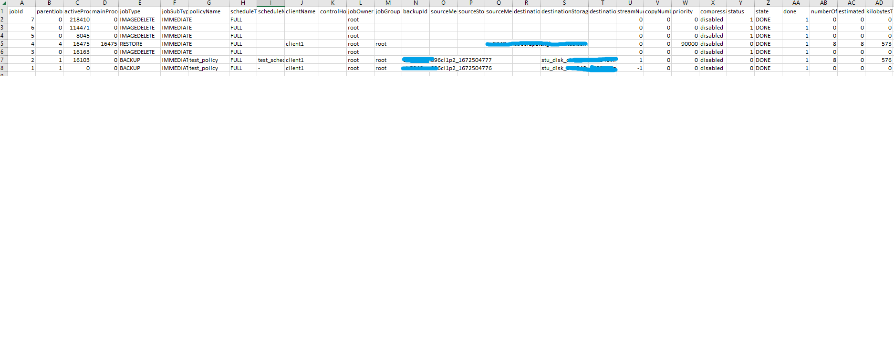

# extract_netbackup_jobs

# Purpose
This tool is to extract all Netbackup jobs from Master server and output CSV format.


# Usage:
```
usage: extract_netbackup_jobs.py --server SERVER --username USERNAME --password PASSWORD
```


